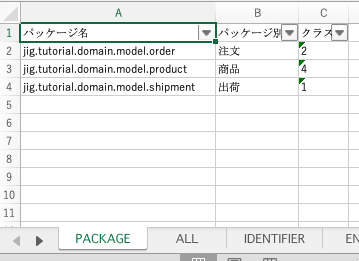

sbt-jigチュートリアル
============================================================

[JIG](https://github.com/dddjava/jig) のsbtプラグインである[sbt-jig](https://github.com/yoshiyoshifujii/sbt-jig)を使用した開発のチュートリアルです。
以下の順番で進めます。

1. プロジェクトの準備
1. sbt-jigの導入
1. ビジネスルールの開発

このチュートリアルを終えれば、コードをどまんなかに据えたモデリングができるようになります。

- 🎓 は説明です。操作はありません。
- 🏷 は本リポジトリのコミットです。やっていることがわからない場合などに使用してください。
- 📝 はチュートリアルからは外れる内容ですが、知っておくと役立つことを書いています。

## プロジェクトの準備

開発するアプリケーションのプロジェクトを作成します。ここでは以下を使用します。

- JDK `8`
- sbt-jig `2020.4.1`
- sbt `1.3.9`
- Graphviz `2.43.0`

### sbtプロジェクトの準備

> このセクションは一般的なsbtプロジェクトの作成です。
> sbtでビルドできるなら、どのような方法で作成しても構いません。

sbtの `new` コマンドを使用してプロジェクトを作成します。

```bash
$ sbt new scala/hello-world.g8
....
name [Hello World template]: sbt-jig-tutorial

Template applied in ./sbt-jig-tutorial
```

sbtの`compile`タスクを実行してください。

```bash
$ sbt compile

[success] Total time: 0 s, completed ...
```

上記のように `success` が出力されればOKです。sbtの確認ができました。
お好きなIDEに取り込んでください。

🏷 [b597fb026a05544516f65df6da7d0e64595257b3](https://github.com/yoshiyoshifujii/sbt-jig-tutorial/commit/b597fb026a05544516f65df6da7d0e64595257b3)

### 🎓 想定するパッケージ構成

JIGが標準でサポートするアーキテクチャは [ドメインを独立させる Isolating the Domain](https://github.com/system-sekkei/isolating-the-domain) です。
Isolating the Domainのパッケージ構成は以下の通りです。

```
.
+-- presentation
|    +-- controller
|    +-- view
+-- application
|    +-- service
|    +-- repository
+-- infrastructure
|    +-- datasource
|    +-- transfer
+-- domain
     +-- type
     +-- model
```

JIGではこれらを「ビジネスルール」と「アプリケーション」に分類します。

- アプリケーション: 三層。 `presentation`, `application`, `infrastructure` パッケージ。
- ビジネスルール: ドメインモデル。 `domain` パッケージ。

📝 Isolating the Domainに準拠していなくても、JIGドキュメント自体の出力は可能です。

📝 sbt-jigでは、主にビジネスルールのJIGドキュメントの出力を重視しています。

## sbt-jigの導入

[sbt-jig](https://github.com/yoshiyoshifujii/sbt-jig) を導入します。

`project`ディレクトリ配下に `jig.sbt`ファイルを作ります。

```sbt
resolvers += Resolver.jcenterRepo
resolvers += Resolver.bintrayIvyRepo("yoshiyoshifujii", "sbt-plugins")
addSbtPlugin("com.github.yoshiyoshifujii" % "sbt-jig" % "2020.4.1")
```

JIGのドキュメントの対象から、Objectを外すため、以下の設定を`build.sbt`に追記します。l

```sbt
jigModelPattern in jig := ".+\\.domain\\.(model|type)\\.[^$]+"
```

`jigReports` を実行して `success` となればOKです。

```bash
$ sbt ";clean;compile;jigReports"
...

(出力が完了しました。: {} ms,2775)ts 2s
[success] Total time: 3 s, completed ...
```

🏷 [8ca7ea547c885611e7dc80c3222691d20c6fc01b](https://github.com/yoshiyoshifujii/sbt-jig-tutorial/commit/8ca7ea547c885611e7dc80c3222691d20c6fc01b)

### 環境の確認

JIGはダイアグラム出力に[Graphviz](https://www.graphviz.org/)を使用しています。
インストールされていることを確認してください。

```bash
$ dot -V
dot - graphviz version 2.43.0 (0)
```

## 🎓 JIGドキュメントの紹介

JIGドキュメントには以下があります。

- ビジネスルールドキュメント
    - BusinessRuleList
    - PackageRelationDiagram
    - BusinessRuleRelationDiagram
    - CategoryDiagram
    - CategoryUsageDiagram
- アプリケーションドキュメント
    - ApplicationList
    - BranchList
    - ServiceMethodCallHierarchyDiagram
    - BooleanServiceDiagram
- アーキテクチャドキュメント
    - ArchitectureDiagram
    - PackageTreeDiagram

これらを使用して開発をすすめます。

## ビジネスルールの開発

ビジネスルールを開発してみましょう。
チュートリアルでは「商品の注文を受けて出荷する」を扱います。


### はじめてのJIGドキュメント
はじめに `jig.tutorial.domain.model.product` パッケージに商品クラスを作成します。
中身は空で構いません。

```scala
package jig.tutorial.domain.model.product

class Product {
}
```

作成できたらsbtで `jigReports` タスクを実行します。
`./target/jig` に `business-rule-relation.svg` が出力されます。


🏷 [1b52d9d0d3f8d344bcf4261cba609b13a3928e25](https://github.com/yoshiyoshifujii/sbt-jig-tutorial/commit/1b52d9d0d3f8d344bcf4261cba609b13a3928e25)

### クラスの関連で開発する
商品としての関心ごとを挙げ、全てに対するクラスを作成していきます。
ここでは商品名と定価を持つとします。

先ほどと同様に`Name`クラスと`Price`クラスを作成します。


🏷 [8895a21538d09da9c10098c6171562e093b7ff3a](https://github.com/yoshiyoshifujii/sbt-jig-tutorial/commit/8895a21538d09da9c10098c6171562e093b7ff3a)

商品名と定価は商品が使用するので、`Product`のフィールドに追加します。

```scala
package jig.tutorial.domain.model.product

class Product(name: Name, price: Price) {
}
```


🏷 [bdfbad4e3f1efed5320a1217c9403ec11cf15f09](https://github.com/yoshiyoshifujii/sbt-jig-tutorial/commit/bdfbad4e3f1efed5320a1217c9403ec11cf15f09)

Scaladocコメントに日本語名を記述します。

```scala
package jig.tutorial.domain.model.product

/**
 * 商品
 */
class Product(name: Name, price: Price) {
}
```


🏷 [ee2855707b547db8611ccfce3f2c97e7a082d8e7](https://github.com/yoshiyoshifujii/sbt-jig-tutorial/commit/ee2855707b547db8611ccfce3f2c97e7a082d8e7)

### パッケージの関連で開発する
次に注文と出荷を開発します。
商品と同様にパッケージとクラスを作成します。

- 注文: `jig.tutorial.domain.model.order`
- 出荷: `jig.tutorial.domain.model.shipment`


🏷 [6f530562162c58934a137e67af92fb84e68e835a](https://github.com/yoshiyoshifujii/sbt-jig-tutorial/commit/6f530562162c58934a137e67af92fb84e68e835a)

注文は商品、出荷は注文と商品を扱います。それぞれフィールドに追加します。


パッケージ間の関連ができると `package-relation-depth*.svg` が出力されます。
和名は `package-info.java` のJavadocで記述できます。


🏷 [4a038b714c269dcc4798bb4ceb684a2f0b259696](https://github.com/yoshiyoshifujii/sbt-jig-tutorial/commit/4a038b714c269dcc4798bb4ceb684a2f0b259696)

### 区分で開発する
取り扱うステータスを `enum` で列挙します。

- 商品在庫: 在庫あり、在庫なし
- 注文ステータス: 注文受付済み、出荷済み、キャンセル

`enum` は `category.png` に出力されます。


商品在庫を商品のメソッドで返します。

```scala
package jig.tutorial.domain.model.product

/**
 * 商品
 */
class Product(name: Name, price: Price) {
  def productStock: ProductStock = ProductStock.在庫あり
}
```

使用が `category-usage.png` に出力されます。


🏷 [2dad1a5ad6a5148daf72bba2f85244b25a0f363f](https://github.com/yoshiyoshifujii/sbt-jig-tutorial/commit/2dad1a5ad6a5148daf72bba2f85244b25a0f363f)

ここまでの設計は `business-rule.xlsx` で一覧できます。




### パッケージを相互依存させてみる
相互依存があると赤矢印が出力されます。


相互依存の原因となっているクラスは `bidirectionalRelations-depth*.txt` に出力されます。

### パッケージをネストさせてみる
パッケージをネストするとパッケージの深さごとにパッケージ関連図が出力されます。


### 💪 チャレンジ

ビジネスルールを自由に開発してみましょう。

#### 使用例: 言葉ファーストでの開発
ドメインの言葉でクラスを作成してScaladocに日本語名を書いていきます。

関連すると思われるクラスをフィールドやメソッドなどで使用しながらラフに関連を設計します。
このアプローチでは処理は二の次で構いません。

ある程度関連が設計できたら処理を記述していきます。
想定外の依存が発生するなどぎこちなくなるとJIGドキュメントからフィードバックが得られます。

## 付録: JIGを使用した開発サイクル

JIGでの開発は以下のようになります。

- 頭の中やホワイトボードなどで描く
- コードで書いてみる
- JIGドキュメントを眺める
- フィードバックを得ながら考える
- コードで書いてみる
- JIGドキュメントを眺める
- ...（以下ループ）


参考: [JIGを使った設計](https://github.com/irof/jjug-ccc-2018-e6)

## 付録: JIGを使用しているリポジトリ

- [isolating-the-domain](https://github.com/system-sekkei/isolating-the-domain)
- [JR運賃計算](https://github.com/masuda220/jr-pricing)
- [割り勘](https://github.com/j5ik2o/warikan-domain)

